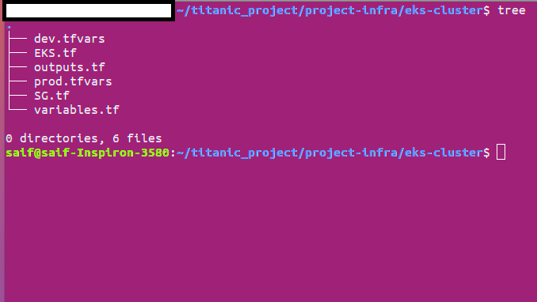

# Titanic Application
> titanic-api is a REST application which offers CRUD operations for existing dataset.

## Developing stack

- `Python Flask`:  a lightweight WSGI web application framework. It is designed to make getting started quick and easy, with the ability to scale up to complex applications. It began as a simple wrapper around Werkzeug and Jinja and has become one of the most popular Python web application frameworks

- `PostgreSQL` is a powerful, open source object-relational database system with over 30 years of active development that has earned it a strong reputation for reliability, feature robustness, and performance.

- `Docker Compose`: Compose is a tool for defining and running multi-container Docker applications. With Compose, you use a YAML file to configure your application's services.
- `Terraform`: Terraform is an open-source infrastructure as code software tool that provides a consistent CLI workflow to manage hundreds of cloud services.

- `Kubernetes`: Kubernetes, also known as K8s, is an open-source system for automating deployment, scaling, and management of containerized applications.

- `Helm`: Helm helps you manage Kubernetes applications — Helm Charts help you define, install, and upgrade even the most complex Kubernetes application.

- `AWS Cloud`: Amazon Web Services offers reliable, scalable, and inexpensive cloud computing services. 

## Assumption And Prerequisites

- You have a `Docker` environment running.
- You have an account in a container registry.
- You have `Python` installed on your machine for testing
- You have `kubectl` installed in your machine.
- You have `helm` installed in your machine.
- You have `terraform` installed in your machine.
- You have `AWS CLi` installed and configured.
- You have a `AWS account`, with a project.


# Endpoints

The application serve following endpoint structure :

 HTTP Verb | Path             | Request Content-Type | Request body | Response Content-Type | Example response body |
|-----------|------------------|----------------------|--------------|-----------------------|-----------------------|
| GET       | `/people`        | `application/json`   | -            | `application/json`    | `[ { "uuid": "49dc24bd-906d-4497-bcfc-ecc8c309ecfc", survived": true, "passengerClass": 3, "name": "Mr. Owen Harris Braund", "sex": "male", "age": 22, "siblingsOrSpousesAboard": 1, "parentsOrChildrenAboard":0, "fare":7.25}, ... ]` |
| POST      | `/people`        | `application/json`   | `{ "survived": true, "passengerClass": 3, "name": "Mr. Owen Harris Braund", "sex": "male", "age": 22, "siblingsOrSpousesAboard": 1, "parentsOrChildrenAboard":0, "fare":7.25}` | `application/json`    |  `{ "uuid": "49dc24bd-906d-4497-bcfc-ecc8c309ecfc", survived": true, "passengerClass": 3, "name": "Mr. Owen Harris Braund", "sex": "male", "age": 22, "siblingsOrSpousesAboard": 1, "parentsOrChildrenAboard":0, "fare":7.25}` |
| GET       | `/people/{uuid}` | `application/json`   | -            | `application/json`    | `{ "uuid": "49dc24bd-906d-4497-bcfc-ecc8c309ecfc", survived": true, "passengerClass": 3, "name": "Mr. Owen Harris Braund", "sex": "male", "age": 22, "siblingsOrSpousesAboard": 1, "parentsOrChildrenAboard":0, "fare":7.25}` |
| DELETE    | `/people/{uuid}` | `application/json`   | -            | `application/json`    | - |
| PUT       | `/people/{uuid}` | `application/json`   | `{ "survived": true, "passengerClass": 3, "name": "Mr. Owen Harris Braund", "sex": "male", "age": 22, "siblingsOrSpousesAboard": 1, "parentsOrChildrenAboard":0, "fare":7.25}` | `application/json`    | - |

## Running the application in your machine :

### Install dependencies:

```bash
    $ python3 -m venv env
    $ source env/bin/activate
    $ pip install flask
    $ pip3 install -U Flask-SQLAlchemy
    $ pip install Flask-Migrate
```
### Running the app:

```bash
  
    $ export POSTGRES_DB=people
    $ export POSTGRES_HOST=localhost
    $ flask run
```

### Copy of DATASET :

> intialize the postgresdatabase:

```bash
    $ flask db init
    $ flask db migrate
    $ flask db upgrade
```
> Connect to postgres and copy the dataset(CSV file):

```bash
    $ sudo -iu postgres psql
    $ \c people
    $ COPY people(survived, pclass, name, sex, age, siblings_Spouses_Aboard, parents_Children_Aboard, fare)  FROM '/home/saif/titanic_project/titanic.csv' DELIMITER ',' CSV HEADER;
```
you have to create a User and garant GRANT ALL PRIVILEGES on DATABASE people to this User.
check the people table: 
```bash
    $ SELECT * FROM people;
```
### Exploring the app

Open http://127.0.0.1:5000/people a browser.

## Build and run the application with Docker Compose:


- Build the images and spin up the containers:

```bash
sudo docker-compose up -d --build
```


> Secrets and enviroments variables are stored an env-files :app.env and db.env

- check the build of the docker images/container titanicapp and titanicdb:

```bash
    $ docker images ls
    $ docker ps -a
```


- Recreate the database and copy the dataset :

```bash
    $ docker exec titanicapp flask db init
    $ docker exec titanicapp flask db migrate
    $ docker exec titanicapp flask db upgrade   
```
> copy the CSV file into the postgres container (use the command : $ cp titanic.csv /tmp/titanic.csv) and COPY the dataset

### Examples of executions (test of endpoints):

To test the diffrent endpoints ,we will use Postman :

- Get all people :


- Get people/id :


## Build ,Scan and Publish of The Docker Image :

The source code already contains the Dockerfile needed for the app :
* Build the image using the command below:
```bash
    $ docker build -t titanic_app_project:v0.0.1 .
```
* scan the docker images using Trivy :

 ```bash
    $ trivy image titanic_app_project:v0.0.1 > image_scan.txt
```
> the scan results is inside the file `image_scan.txt` under `assests` folder

* upload the image to your registry(Docker Hub repo):

 ```bash
    $ docker login
    $ docker tag titanic_app_project:v0.0.1  <user_ID>/app_project:v0.0.1
    $ docker push <user_ID>/app_project:v0.0.1
```

## build and run into EKS cluster using Terrafrom:

> In this section ,we will prepare the infrastructure of the application and deploy it to EKS cluster by using Terraform and Helm :

* Verify that the Terraform tool has been installed correctly with:
```bash
    $ terrafrom version
```
* Verify the Kubectl has benn installed correctly with :
```bash
    $ kubectl version --client --output=yaml
```
Verify the AWS cli has benn installed correctly with :
```bash
    $ /usr/local/bin/aws --version
```
> After you've installed the AWS CLI, configure it by running aws configure and add your access key and Secret key.

####  Provisioning a cluster using Terraform

**Create dev EKS cluster**

- Set the working directory to project_infra/eks_cluster :


The code is on the eks_cluster folder in the following structure:



- Initialize tge Terraform code

```bash
terraform init
``` 

- Verify the formatting, and the code validity 

```bash
terraform fmt
terraform validate
``` 

- Plan and apply Terraform code

```bash
terraform plan --var-file=dev.tfvars --out=dev_plan_outputs.json
```

```bash
terraform apply "dev_plan_outputs.json"
```

Repeat the same steps for the production cluster, replace `dev.tfvars` by `prod.tfvars`, `dev_plan_outputs.json` by `prod_plan_outputs.json` 

- Terrafrom plan log :

- Check the EKS cluster on AWS console :


- Use Kubectl to manage the cluster :

 * To get the dev kubeconfig credentials you can use the following aws cli command:

```bash
   $ aws eks --region us-east-1 update-kubeconfig --name titanic-cluster1-dev
```

* Export the kubeconfig file:

```bash
export KUBECONFIG=~/.kube/kubeconfig-dev # <--- path to your kubeconfig file, used by kubectl to connect to the cluster API
export KUBE_CONFIG_PATH=~/.kube/kubeconfig-dev # need for Terraform Kubernetes/Helm provider
``` 
* Check the cluster nodes

```bash
➜ kubectl get nodes
``` 
> Same steps needed for the production cluster!

### Deploy PostgreSQL Cluster with Terraform and Helm

#### 1- Structure

In this setup we are going to use Terraform, Helm and the Terraform Helm Provider to deploy a PostgreSQL on the DEV EKS cluster 

The code is on the `DB` folder in the following structure:


#### 2- Deployment

- Set the working directory to postgresql/deployment

```bash
cd .. && cd DB/deployment
```

- Initialize tge Terraform code

```bash
terraform init
``` 

- Verify the formatting, and the code validity 

```bash
terraform fmt
terraform validate
``` 

- Plan and apply Terraform code

```bash
terraform plan --var-file=dev.tfvars --out=postgresql_dev_plan_outputs.json
```

Terraform will ask you to add the secret variables such as the PostgreSQL credentials. 


```bash
terraform apply "postgresql_dev_plan_outputs.json"
```

> Repeat the same steps for the production cluster, replace `dev.tfvars` by `prod.tfvars`, `postgresql_dev_plan_outputs.json` by `postgresql_prod_plan_outputs.json` 


#### 3- Checking the PostgreSQL resources on EKS

```bash
➜ kubectl get all -n db
```


> the PostgreSQL resources are provisioning in a siparte namespace called "db"

### Deploy Flask Server App on GKE with Terraform and Helm

#### 1- Structure

In this setup we are going to use Terraform, Kubernetes YAML, Helm and the Terraform Helm Provider to deploy the application on the  EKS cluster.

The code is on the `titanic_app/` folder in the following structure:


#### 2- Deployment

- Set the working directory to titanic_app/deployment

```bash
cd ../.. && cd titanic_app/deployment
```

- Initialize the Terraform code

```bash
terraform init
``` 

- Verify the formatting, and the code validity 

```bash
terraform fmt
terraform validate
``` 

- Plan and apply Terraform code

```bash
terraform plan --var-file=dev.tfvars --out=app_dev_plan_outputs.json
```
Terraform will ask you to add the secret variables such as the PostgreSQL credentials. See the following screenshot and terminal log:


```bash
terraform apply "app_dev_plan_outputs.json"
```
> Repeat the same steps for the production cluster, replace `dev.tfvars` by `prod.tfvars`, `app_dev_plan_outputs.json` by `app_prod_plan_outputs.json` 


#### 3- Checking the App deployment on EKS

```bash
kubectl get all -n app
```

> the App resources are provisioning in a siparte namespace called "app"

- check all ressources deployed:


> Run the same steps to initalize and copy the dataset by using the "kubectl exec command"

```bash
kubectl exec -it -n app  server-68f6b9c48d-9kwdk -- flask db init
kubectl exec -it -n app  server-68f6b9c48d-9kwdk -- flask db migrate
kubectl exec -it -n app  server-68f6b9c48d-9kwdk -- flask db upgrade
```


```kubectl exec -it -n api bitnami-postgresql-0 -- psql -U postgres
kubectl cp -n db titanic.csv bitnami-postgresql-0:/tmp/
COPY people(survived, pclass, name, sex, age, siblings_Spouses_Aboard, parents_Children_Aboard, fare)  FROM '/tmp/titanic.csv' DELIMITER ',' CSV HEADER;
```
### 4- Test the Application 

To test the application functionality we need first to grab the cluster HTTP Load Balancer IP, as following:

```bash
kubectl get svc -n app
```

the service IP is : a40ced4d16f2847d4ae29096639dd83f-577852132.us-east-1.elb.amazonaws.com
 
 - Get people :
 

 - Get people/50 :
 

 - delete people/200:
 

 - PUT : update the name of people with id=30 from  "Master. Juha Niilo Panula" to  "Master. Juha Niilo Panula-updated"
 
 

 - POST: add a "new people" to the titainc_db :
 
 
## More steps to build a proper Cloud Native system

1. CI/CD: well CI/CD for everything, end-to-end CI/CD pipelines will be needed to deploy the infrasturce and the application

3. Use Terraform remote state to manage the state files

4. Use a proper Secret Management system to manage and inject secrets.

5. Monitoring and logging 

6. Testing 


